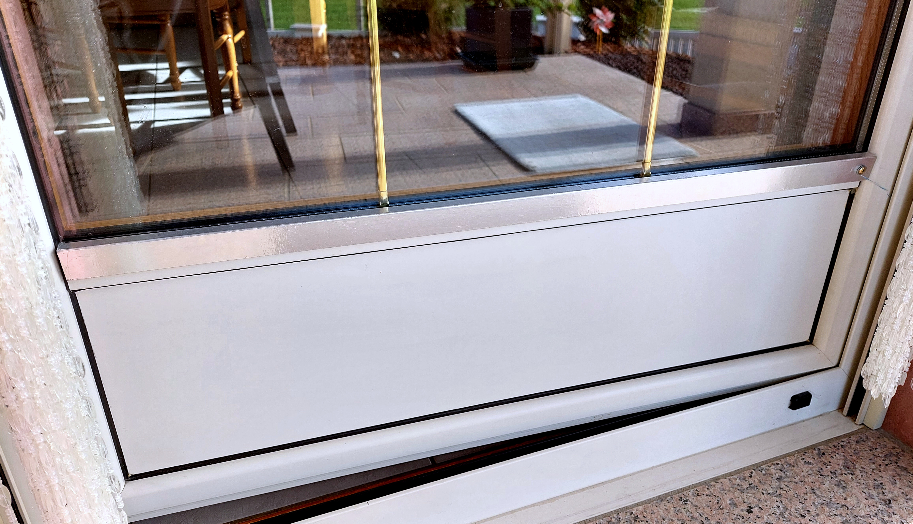
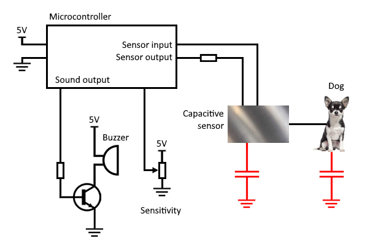
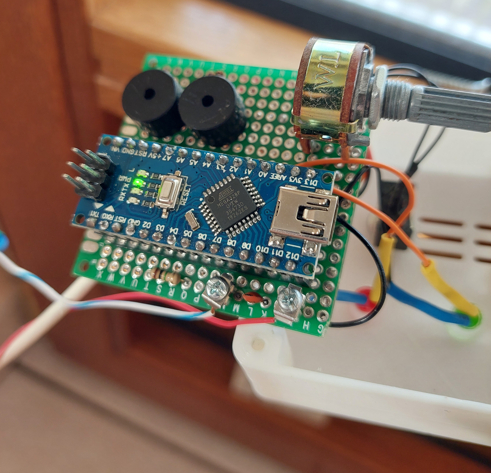
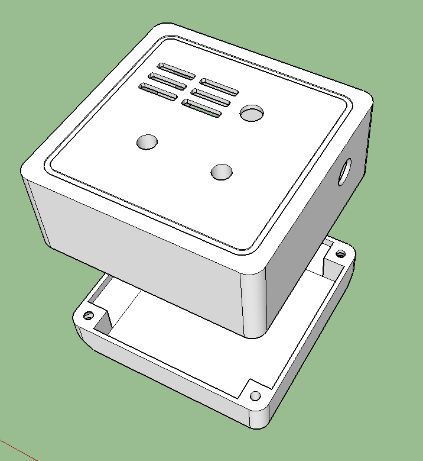

Dog Doorbell
============

This project is a capacitive sensor with a buzzer designed to detect when a dog is at the door and signal the owners to open it. Useful if the dog stands against the door to get inside instead of barking. When the dog touches the sensor, the buzzer rings.

Working principle
-----------------

The sensor is simply a piece of metal. It forms a very low-value capacitor with respect to its environment. When the dog touches the sensor, it adds its own capacitance to the system.

This capacitance can easily be estimated by a microcontroller by applying a voltage to the sensor through a high-value resistor. This slowly charges the capacitor, causing the sensor’s voltage to rise. We then measure the time it takes for an input directly connected to the sensor to register a high level. The more mass that is touching the sensor, the greater the capacitance relative to the environment, and the longer it takes to charge the sensor.

This process is repeated multiple times per second, and the readings are averaged and filtered. When the microcontroller detects a sudden increase in capacitance (when the value exceeds the set sensitivity threshold), the buzzer plays a sound, indicating that the dog is touching the sensor and wants to come inside.

Electronics are soldered by hand on a perfboard.

Programming
-----------

The microcontroller is an Arduino Nano programmed using the Arduino IDE.
It uses the [Tone library by bhagman](https://github.com/bhagman/Tone) to play tones on two pins simultaneously. 2 spare hardware timers are required for that. The default Arduino library only alows to play a tone on one pin at a time. Using two buzzers instead of one allows to create more interesting music.

3D models
---------

The case was designed to fit the door and was 3D-printed. It has holes for a switch, a potentiometer, two LEDs, two wires (power and sensor) and holes to let sound out. It holds the PCB in place when the two pieces are screwed together. The 3D models were created using Sketchup.

